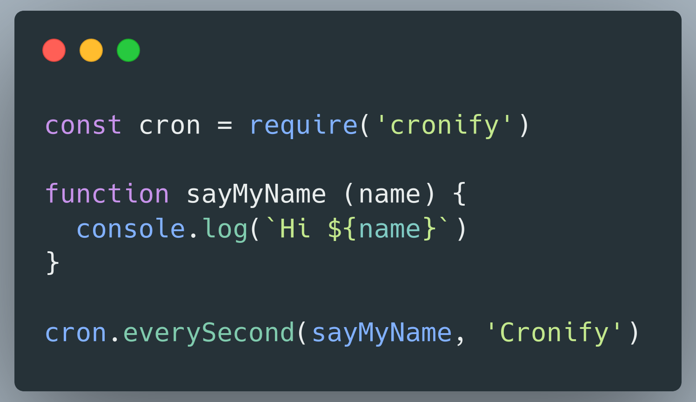

<h1 align="center" style="font-size: 80px; border:none; margin: 0px; padding: 0px">Cronify
<!-- <br/> -->
<h4 align="center" style="margin: 0px; padding: 0px">Making Cron Simple - uses node-cron under the hood</h4>
</div>

<div style="display:flex; align-items:center; justify-content: center">

</div>

### npm
```
npm install cronify
```

### yarn
```
yarn add cronify
```

## 💡 API <a name="api"></a>

**cronify**```(cronParams, fn, fnArgs)```
```javascript
const cron = require('cronify')

// simple node-cron as you like it
cron.cronify('*/1 * * * * *', console.log, 'hello') // This will log hello world every second
```
---
**everySecond**```(fn, fnArgs)```
```javascript
const cron = require('cronify')

cron.everySecond(console.log, 'hello') // This will log hello world every second
```
---
**everyNthSecond**```(seconds, fn, fnArgs)```
```javascript
const cron = require('cronify')

cron.everyNthSecond(2, console.log, 'hello') // This will log hello world every 2 seconds
```
---
**everyMinute**```(fn, fnArgs)```
```javascript
const cron = require('cronify')

cron.everyMinute(console.log, 'hello') // This will log hello world every minute
```
---
**everyNthMinute**```(fn, fnArgs)```
```javascript
const cron = require('cronify')

cron.everyNthMinute(2, console.log, 'hello') // This will log hello world every 2 minutes
```